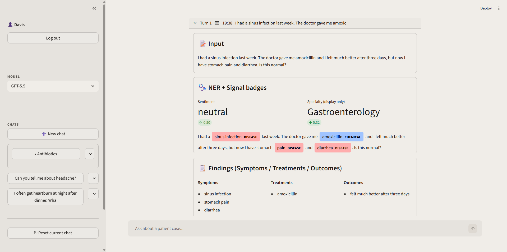
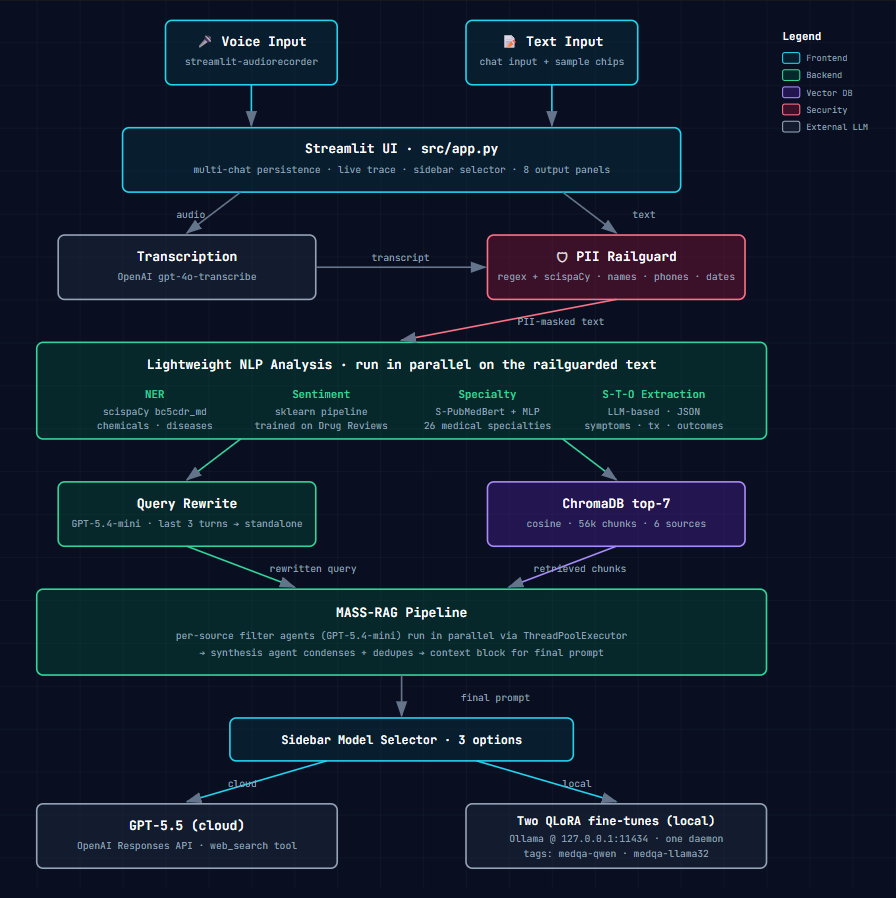
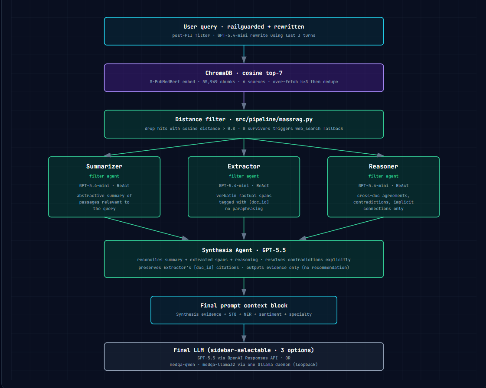
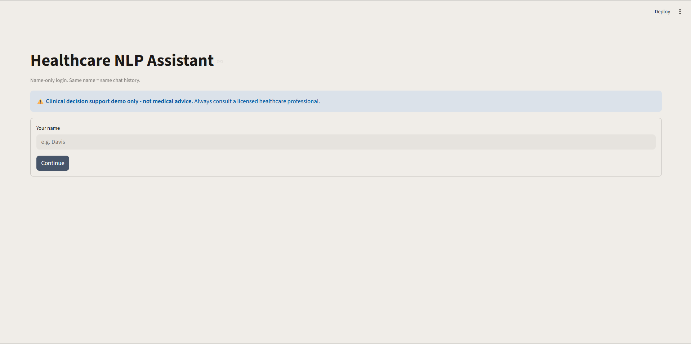
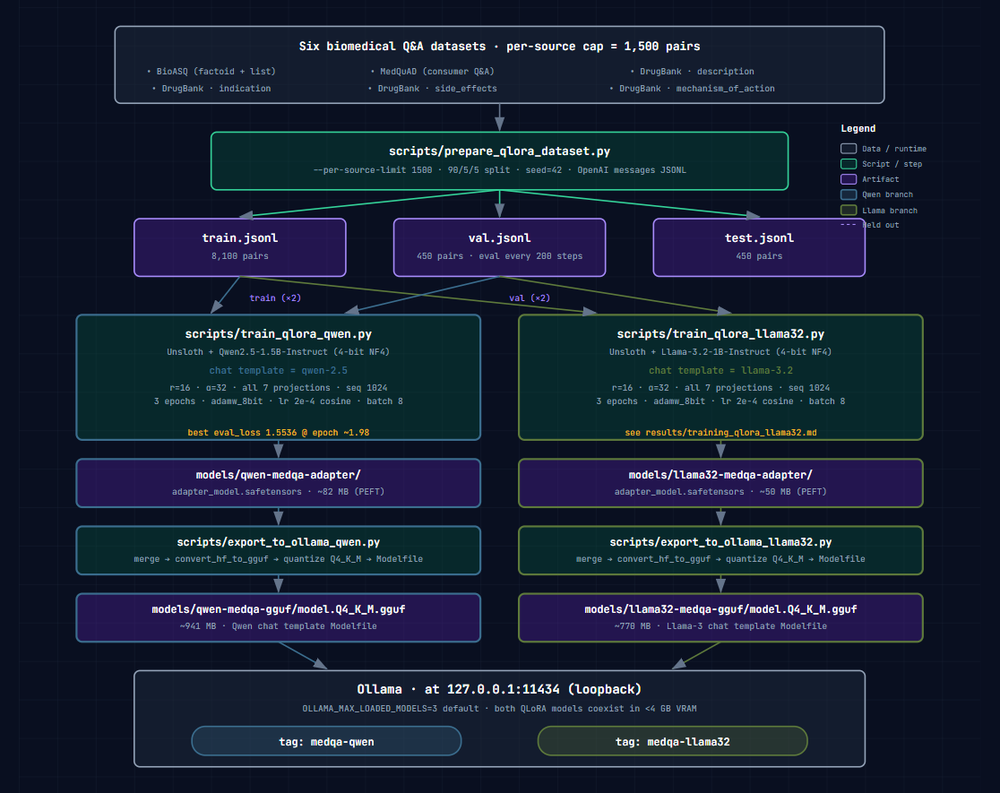

<div align="center">
  

  <h1>Healthcare NLP Assistant</h1>

  <p><i>A locally-deployable clinical Q&A system: voice in, privacy-filtered, multi-agent RAG, with two QLoRA-fine-tuned local LLMs (Qwen2.5-1.5B + Llama-3.2-1B) benchmarked head-to-head against GPT-5.5.</i></p>

  <p>
    <a href="https://huggingface.co/Davis426/COMP8420-Healthcare-LLM-Assistant"></a>
    
    
    
  </p>
</div>

---

## Three things worth opening this repo for

1. **End-to-end voice pipeline** → PII railguard → grounded clinical recommendation. Speak a symptom into the browser; get a recommendation in under 10 seconds. PII is masked before any LLM call.

2. **Multi-agent retrieval (MASS-RAG)** over six biomedical knowledge bases (~55.9k cleaned chunks). Three role-based filter agents (Summarizer · Extractor · Reasoner) fan out in parallel over the retained hits; a synthesis agent reconciles their outputs before the final LLM call. Drops in GPT-5.5 (cloud) or either QLoRA model (Qwen / Llama) via Ollama.

3. **3-way bake-off: GPT-5.5 vs QLoRA Qwen2.5-1.5B vs QLoRA Llama-3.2-1B**, evaluated three ways: ROUGE / BERTScore (PubMedBERT backbone) / LLM-as-judge. Both QLoRA variants share the same data + recipe so any gap isolates the base-model contribution. Includes a written-up negative finding (template substitution beats factual improvement on surface metrics) because that's the more honest story.



---

## Architecture



Each user turn renders 8 panels top-to-bottom in the UI: input, transcript (if audio), railguard diff, NER / sentiment / specialty / S-T-O, retrieval, MASS-RAG agents, recommendation. The last 3 turns drive contextual query rewriting before retrieval and are prepended to the final prompt.

### MASS-RAG retrieval in detail

Implementation follows the **MASS-RAG** design from [Xiao et al., 2026 (arXiv:2604.18509)](https://arxiv.org/abs/2604.18509), specialised to the six biomedical sources in this repo.



Standard RAG dumps the top-k retrieved passages straight into the final prompt and trusts the LLM to figure out what matters. MASS-RAG inserts a layer of *three analyst agents* between retrieval and generation. Each one reads the *same* retained passages through a different lens, and a synthesis agent then reconciles their outputs into a single evidence block before the final LLM ever sees it.

**The three filter agents** (all GPT-5.4-mini on a ReAct scaffold, all seeing the same retained hits):

- **Summarizer** writes an abstractive, query-focused summary of what the passages say. It does not answer the question; it just compresses the relevant material.
- **Extractor** copies *verbatim* spans from the passages and tags each with its `[doc_id]`. No paraphrasing. This is what lets the downstream answer cite source text it did not invent.
- **Reasoner** looks across passages for agreements, contradictions, and implicit connections, with a hard rule not to bring in outside knowledge. Every inference must be grounded in the retrieved text.

The three run in parallel via `ThreadPoolExecutor(max_workers=3)`, so retrieval wall time is roughly `max(agent_latency)` not the sum.

**The synthesis agent** (GPT-5.5) then receives all three outputs together with the original query, reconciles them into a single coherent evidence block, resolves any contradictions the Reasoner surfaced, and preserves the Extractor's `[doc_id]` citations. Its output is evidence only (no recommendation). The downstream LLM (cloud GPT-5.5 or one of the local QLoRA models — Qwen2.5-1.5B or Llama-3.2-1B) is what produces the actual recommendation, with this evidence block plus the NER / S-T-O findings concatenated into its prompt.

**Fallback path.** Hits with cosine distance > 0.8 are dropped before the agents run. If no hits survive (the knowledge base has nothing relevant), MASS-RAG is skipped entirely and the final LLM is invoked with `enable_web_search=True` plus a "no KB match" prompt instead.

**Why split the read.** On long DrugBank entries or multi-paragraph BioASQ abstracts, a single-pass LLM tends to either skim the surface and miss the relevant span, or hallucinate connecting tissue. Splitting the read across three specialised roles makes the misses observable in the per-agent panels in the UI, and gives the synthesis step structured material to reconcile rather than raw text to grep through.

---

## Tech stack

| Layer | Choice |
|---|---|
| UI | Streamlit + `streamlit-audiorecorder` + `static-ffmpeg` |
| Vector DB | ChromaDB 1.5.9 (cosine, persistent) |
| Embeddings | `pritamdeka/S-PubMedBert-MS-MARCO` |
| Medical NER | scispaCy 0.5.4 + `en_ner_bc5cdr_md` |
| Cloud LLM | OpenAI Responses API (GPT-5.5 generation, GPT-5.4-mini filter agents, GPT-5.4 judge) |
| Local LLM | Two QLoRA fine-tunes (Qwen2.5-1.5B-Instruct, Llama-3.2-1B-Instruct), both served by one Ollama daemon at `127.0.0.1:11434` |
| Fine-tune | Unsloth (`peft`, `trl`, `bitsandbytes`) + manual llama.cpp export |
| Transcription | `gpt-4o-transcribe` API |
| Classical ML | scikit-learn (sentiment + specialty classifier) |

---

## Quickstart

### Minimal: just try the QLoRA models via Ollama

```bash
# 1. Install Ollama (https://ollama.com/download). On Windows it auto-starts as a service.

# 2. Pull both fine-tunes (or one) from Hugging Face. The HF repo has them in
#    sibling subfolders qwen/ and llama32/.
pip install huggingface_hub
huggingface-cli download Davis426/COMP8420-Healthcare-LLM-Assistant \
  --include "qwen/qwen-medqa-gguf/*" --local-dir ./models
huggingface-cli download Davis426/COMP8420-Healthcare-LLM-Assistant \
  --include "llama32/llama32-medqa-gguf/*" --local-dir ./models

# 3. Register both with Ollama (one daemon serves both tags concurrently).
cd models/qwen/qwen-medqa-gguf && ollama create medqa-qwen -f Modelfile && cd ../../..
cd models/llama32/llama32-medqa-gguf && ollama create medqa-llama32 -f Modelfile && cd ../../..

# 4. Ask anything (pick a tag).
ollama run medqa-qwen "What are the side effects of amoxicillin?"
ollama run medqa-llama32 "What are the side effects of amoxicillin?"
```

### Full system: voice + RAG + sidebar model selector

```bash
# 1. Clone + create env.
git clone https://github.com/NhatNguyen3001/COMP8420-Healthcare-LLM-Assistant.git
cd COMP8420-Healthcare-LLM-Assistant
conda create -n healthcare_nlp python=3.11 -y && conda activate healthcare_nlp
pip install -r requirements.txt

# 2. Install the scispaCy NER model (wheel, not on PyPI).
pip install https://s3-us-west-2.amazonaws.com/ai2-s2-scispacy/releases/v0.5.4/en_ner_bc5cdr_md-0.5.4.tar.gz

# 3. Set up your OpenAI key.
cp .env.example .env
# Edit .env and paste your OPENAI_API_KEY.

# 4. Install Ollama (https://ollama.com/download), then fetch + register both local models.
#    --target {qwen,llama32,both} controls what's downloaded; default is both.
python scripts/download_model_from_hf.py
cd models/qwen-medqa-gguf && ollama create medqa-qwen -f Modelfile && cd ../..
cd models/llama32-medqa-gguf && ollama create medqa-llama32 -f Modelfile && cd ../..

# 5. Build the ChromaDB index (see "Datasets" below for raw data; takes ~10 min).
python scripts/build_chromadb.py

# 6. Launch the UI.
streamlit run src/app.py
```

The login screen accepts any name (no password). Same name on next launch = same chat history.

<div align="center">
  
</div>

The sidebar has a 3-way model selector for the final-answer generator: **GPT-5.5 (cloud)**, **QLoRA Qwen2.5-1.5B (local)**, or **QLoRA Llama-3.2-1B (local)**. MASS-RAG filter agents always stay on the cloud; only the final-answer generator switches.

---

## QLoRA training (if you want to reproduce or retrain)



```bash
# Build the 9,000-pair train/val/test splits from raw datasets (shared across both QLoRA variants).
python scripts/prepare_qlora_dataset.py --per-source-limit 1500

# --- Qwen variant (~95 min on RTX 4060 8GB) ---
python scripts/train_qlora_qwen.py
python scripts/export_to_ollama_qwen.py

# --- Llama-3.2 variant (~30-45 min on RTX 4060 8GB; smaller base) ---
# Llama-3.2 is gated: accept the licence at https://huggingface.co/meta-llama/Llama-3.2-1B-Instruct
# and `huggingface-cli login` with a token that has access first.
python scripts/train_qlora_llama32.py
python scripts/export_to_ollama_llama32.py
```

The trainer state lands in `models/{qwen,llama32}-medqa-adapter/`; the deployable GGUFs land in `models/{qwen,llama32}-medqa-gguf/`. Loss curves and the source mix chart land in `results/qlora_loss_curve.png` + `results/qlora_source_mix.png`; the Hugging Face model card has the full hyperparam write-up. The two scripts share the same dataset and the same LoRA shape (r=16, α=32, all 7 projection layers) so any quality gap between them isolates the base-model effect.

---

## Repo layout

```

├── src/
│   ├── app.py                     # Streamlit entry point
│   ├── pipeline/                  # railguard, NER, sentiment, classifier,
│   │                              # STO, chromadb, MASS-RAG, llm router
│   ├── audio/                     # transcriber (gpt-4o-transcribe client)
│   ├── storage/                   # chat-history JSON CRUD
│   └── utils/config.py            # single env-loading point
├── notebooks/                     # evaluation notebooks 01-07
├── scripts/
│   ├── build_chromadb.py
│   ├── prepare_qlora_dataset.py
│   ├── train_qlora_qwen.py            # QLoRA fine-tune on Qwen2.5-1.5B base
│   ├── train_qlora_llama32.py         # QLoRA fine-tune on Llama-3.2-1B base
│   ├── train_sentiment.py
│   ├── train_classifier.py
│   ├── export_to_ollama_qwen.py       # merge + GGUF + Q4_K_M + Modelfile for Qwen
│   ├── export_to_ollama_llama32.py    # same for Llama
│   ├── plot_training.py
│   ├── upload_model_to_hf.py          # --target {qwen,llama32,both}
│   └── download_model_from_hf.py      # --target {qwen,llama32,both}
├── knowledge_bases/               # knowledge bases for the project
├── results/                       # eval CSVs + chart PNGs
├── assets/                        # screenshots, logo, architecture diagrams
├── data/qlora_training/           # train / val / test JSONL splits (seed 42)
├── .env.example
├── requirements.txt
└── README.md
```

Heavy artifacts (`data/chromadb/`, `models/qwen-medqa-*`, `models/llama32-medqa-*`, raw `knowledge_bases/`) are gitignored. Trained models come from Hugging Face; ChromaDB rebuilds from `scripts/build_chromadb.py`.

---

## Datasets

Six public biomedical sources feed the knowledge base; two more are used for training-only (sentiment + NER baselines). All raw data is gitignored (license-restricted or large); pull from the official sources below.

| Source | Use | Where |
|---|---|---|
| Medical Transcriptions (mtsamples) | RAG + classifier training | https://www.kaggle.com/datasets/tboyle10/medicaltranscriptions |
| BioASQ training14b | RAG | http://participants-area.bioasq.org/datasets/ |
| MedQuAD | RAG + QLoRA training | https://github.com/abachaa/MedQuAD |
| DrugBank (full DB XML) | RAG + QLoRA training | https://go.drugbank.com/releases/latest (academic license) |
| MedRAG textbooks (7 books) | RAG | https://huggingface.co/datasets/MedRAG/textbooks |
| MedText | RAG | https://huggingface.co/datasets/BI55/MedText |
| BC5CDR | NER eval baseline | https://huggingface.co/datasets/bigbio/bc5cdr |
| UCI Drug Reviews | Sentiment training | https://archive.ics.uci.edu/dataset/461/drug+review+dataset+druglib+com |

Cleaning scripts live in the per-source folders under `knowledge_bases/`. The Q&A pairs used for QLoRA training (9,000 stratified across 6 sources, 90/5/5 split, `seed=42`) are shipped under `data/qlora_training/` for evaluation reproducibility.

---

## Evaluation highlights

100 stratified test pairs (`SAMPLE_N=100`, `seed=42`) drawn from the QLoRA test split, evaluated three ways. Full numbers + charts in [`results/`](results/).

### Surface metrics (ROUGE + BERTScore with PubMedBERT backbone)

| Metric | GPT-5.5 | QLoRA Qwen2.5-1.5B | QLoRA Llama-3.2-1B |
|---|---|---|---|
| ROUGE-1 | 0.2955 | 0.2997 | **0.3049** |
| ROUGE-2 | 0.0907 | **0.1087** | 0.1105 |
| ROUGE-L | 0.1921 | **0.2101** | 0.2046 |
| BERTScore-F1 | 0.8221 | **0.8293** | 0.8272 |

Both QLoRA models edge out GPT-5.5 on surface metrics. The win is driven by **template substitution** on DrugBank-style entries (71+ sibling templates in train share the same skeleton); the fine-tunes learn the template and slot-fill the entity at inference. ROUGE and BERTScore reward this even when the substituted entity is wrong.

### LLM-as-judge (GPT-5.4, 0-10 scale)

| Dimension | GPT-5.5 | QLoRA Qwen | QLoRA Llama-3.2 |
|---|---|---|---|
| Accuracy | **9.26** | 3.57 | 2.77 |
| Completeness | **8.24** | 3.08 | 2.70 |
| Clarity | **9.35** | 6.69 | 6.41 |
| Safety | **9.56** | 5.01 | 4.47 |

GPT-5.5 dominates on all judge dimensions. The Accuracy gap is the headline: the 1B-scale fine-tunes frequently hallucinate plausible-sounding but factually wrong medical content that surface metrics cannot detect. Between the two locals, Qwen edges Llama-3.2 on every judge dimension.

### Latency (RTX 4060 local, GPT-5.5 cloud)

| Model | Mean latency |
|---|---|
| GPT-5.5 (cloud) | 7.22 s |
| QLoRA Qwen (local) | 0.98 s |
| QLoRA Llama-3.2 (local) | **0.63 s** |

Both local models are 7-11x faster than the cloud path. Llama-3.2 is the fastest due to its smaller parameter count (1B vs 1.5B).

**Honest framing**: surface metrics favour the fine-tunes; the LLM-as-judge Accuracy dimension (the load-bearing factuality measure) strongly favours GPT-5.5. The fine-tunes are fast and good at reproducing corpus writing style, but they hallucinate medical facts. See `notebooks/05_llm_generation_evaluation.ipynb` for the template-substitution analysis and `notebooks/07_model_comparison.ipynb` for the full 3-way synthesis.

---

## Limitations

- **Not for real clinical use.** This is a teaching / research artifact. Final outputs include a non-clinical disclaimer; please respect it.
- **Catastrophic forgetting** on out-of-distribution prompts (the fine-tune narrows the base model's conversational range).
- **Weakened in-context grounding** in both local models: training pairs have no context block, so the QLoRA fine-tunes tend to answer from parametric memory even when correct evidence is supplied in the prompt. MASS-RAG retrieval still runs and is shown to the user; GPT-5.5 grounds in it better.
- **English only.** Datasets and prompts are English.
- **PII railguard is regex-based** (with scispaCy NER backup), not a learned model. Adversarial inputs may slip through.
- **Local-only deployment.** No cloud public URL is included; demo is via the assignment video.

---

## Acknowledgements

- Base models: [Qwen2.5-1.5B-Instruct](https://huggingface.co/Qwen/Qwen2.5-1.5B-Instruct) (Alibaba, Apache-2.0) and [Llama-3.2-1B-Instruct](https://huggingface.co/meta-llama/Llama-3.2-1B-Instruct) (Meta, Llama 3.2 Community Licence)
- QLoRA: [Dettmers et al., 2023](https://arxiv.org/abs/2305.14314)
- MASS-RAG: [Xiao, Huang, Liu, Xie, 2026](https://arxiv.org/abs/2604.18509)
- Clinical semantic search embeddings: [Excoffier et al., 2024](https://arxiv.org/abs/2401.01943)
- Healthcare NER with language model pretraining: [Tarcar et al., 2019](https://arxiv.org/abs/1910.11241)
- [Unsloth](https://github.com/unslothai/unsloth) for fast QLoRA training
- [llama.cpp](https://github.com/ggml-org/llama.cpp) + [Ollama](https://ollama.com) for local serving
- [ChromaDB](https://www.trychroma.com/) for the vector store
- [scispaCy](https://allenai.github.io/scispacy/) for medical NER
- [PubMedBERT](https://huggingface.co/microsoft/BiomedNLP-BiomedBERT-base-uncased-abstract-fulltext) (Microsoft) for BERTScore semantic evaluation
- Built for COMP8420 (Macquarie University)

---

## License

MIT — see [LICENSE](LICENSE).

Both fine-tuned models on Hugging Face are licensed separately under CC-BY-NC-4.0 (see the model card for rationale). The Llama-3.2 base additionally carries Meta's Llama 3.2 Community Licence.
